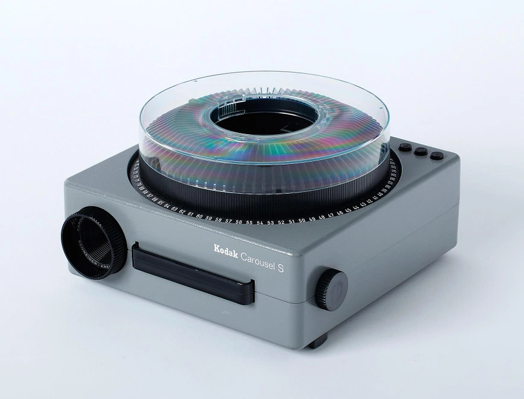
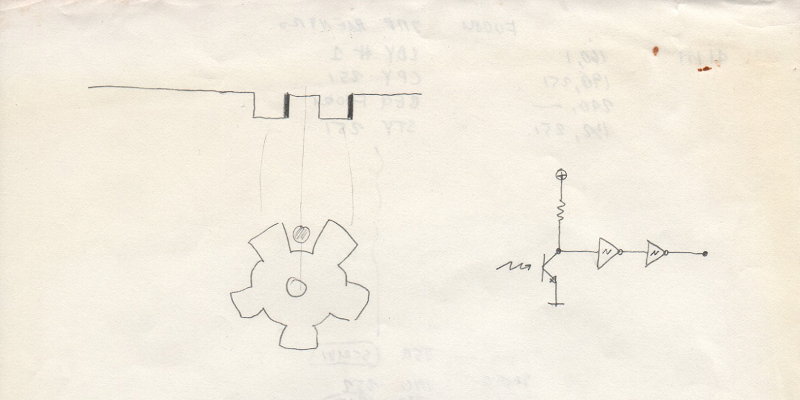
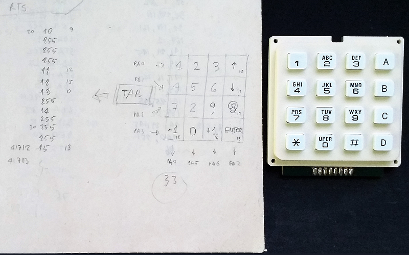

****** CAROUSEL ******
======================
BY RADIO DELFI 1984

Un programma per controllare un proiettore di diapositive con il Commodore VIC-20 
---------------------------------------------------------------------------------
Questo programma è stato sviluppato per trasformare il VIC-20 in un dispositivo di controllo del proiettore di diapositive Kodak Carousel con caricatore circolare.  

Il programma BASIC **carousel.bas** carica in memoria il programma Assembly 6502 **carousel.asm** presente nella cartella *assembly* che fornisce le funzioni per:
- proiettare la diapositiva che corrispondente al numero inserito da tastiera (da 1 a 80)
- calcolare il percorso più veloce
- proiettare la diapositiva successiva o precedente
- accendere e spegnere la lampada di proiezione 
- mettere a fuoco
- ecc. 

Per fornire queste funzionalità, il VIC-20 è stato connesso tramite il chip VIA 6522 a:
- attuatore del motore di movimento del caricatore delle diapositive
- attuatore del motore di movimento dell'obiettivo
- rilevatore optoelettronico di movimento del motore del caricatore delle diapositive  
- tastierino a 16 tasti per azionale le funzioni  

Nella cartella *simulatore* è presente un programma BASIC (**simulatore.bas**) che è uno dei programmi scritti per provare il funzionamento della soluzione.

### VICE - the Versatile Commodore Emulator
CAROUSEL è stato avviato senza errori sull'emulatore VICE che può essere scaricato qui... http://vice-emu.sourceforge.net/. Il codice BASIC che carica il linguaggio macchina, può essere copiato ed incollato direttamente su VICE con la funzione *Edit/Paste*. Per comodità, nella cartella *tap* è inserito il file **carousel.tap** che può essere caricato ed eseguito con la funzione *Attach datasette image ...* di VICE.

### Archeologia informatica
Le funzionalià del programma CAROUSEL non sono state testate in un ambiente reale (VIC-20, Kodak Carousel, interfacce, ecc.). Il programma va utilizzato esclusivamente come esempio di programmazione pioneristica per l'impiego dei primi computer basati su microprocessore nel campo delle applicazioni per il controllo di dispositivi elettromeccanici. 

Nella cartella *docs* sono presenti alcune scansioni di documenti originali dell'epoca in cui è presente del codice. I documenti contengono varie stesure dei programmi ed appunti di progetto. Questi documenti sono stati inseriti per dimostrare che in mancanza di strumenti IDE la programmazione era anche un esercizio di grande pazienza. Il codice Assembly 6502 di questo programma fu inserito e testato nel VIC-20 utilizzando il programma **ASSBLY TOOL** presente nella repository... https://github.com/s9r5/assbly/ 